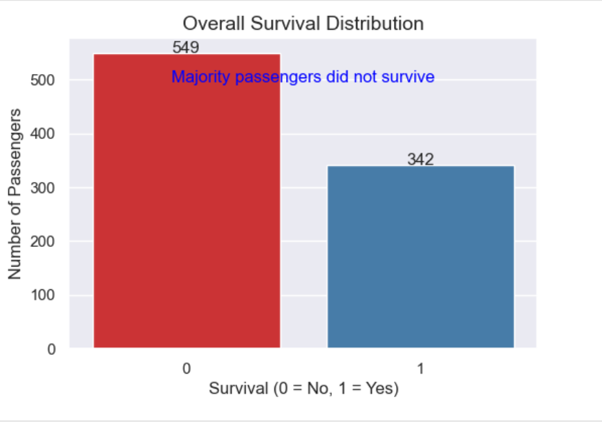
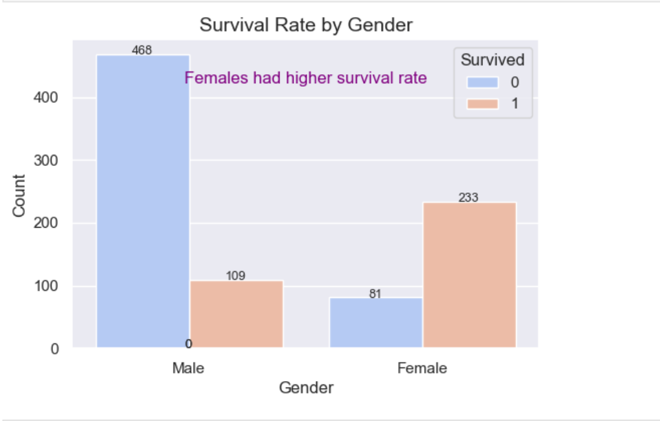
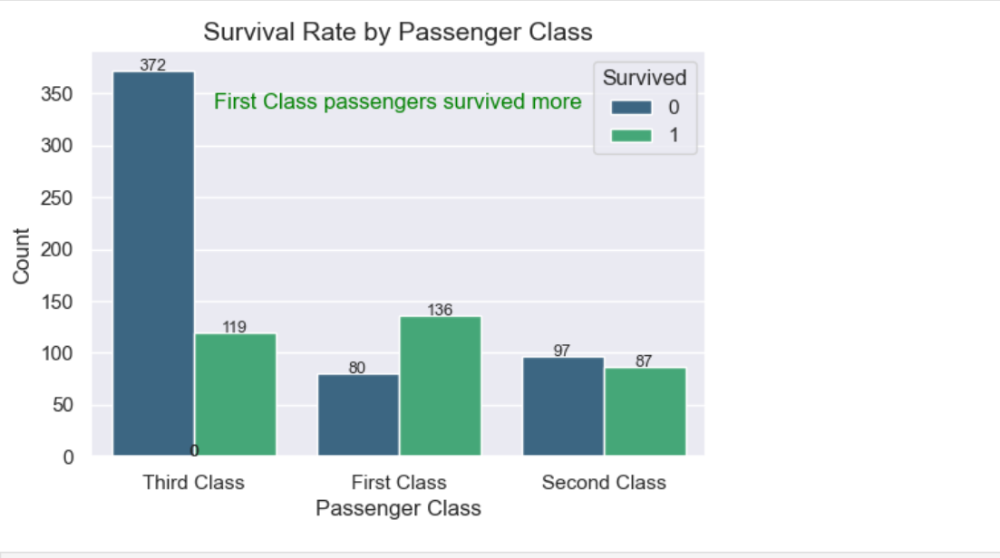
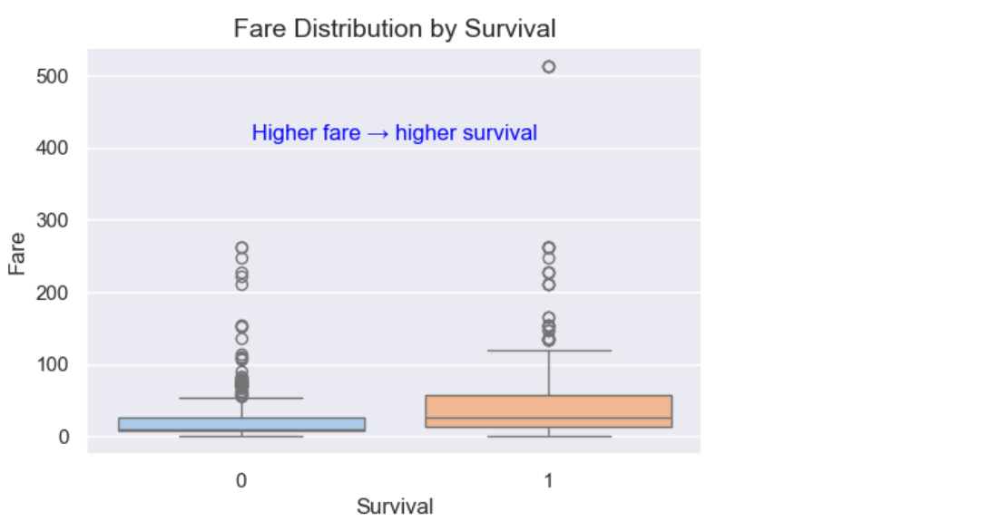
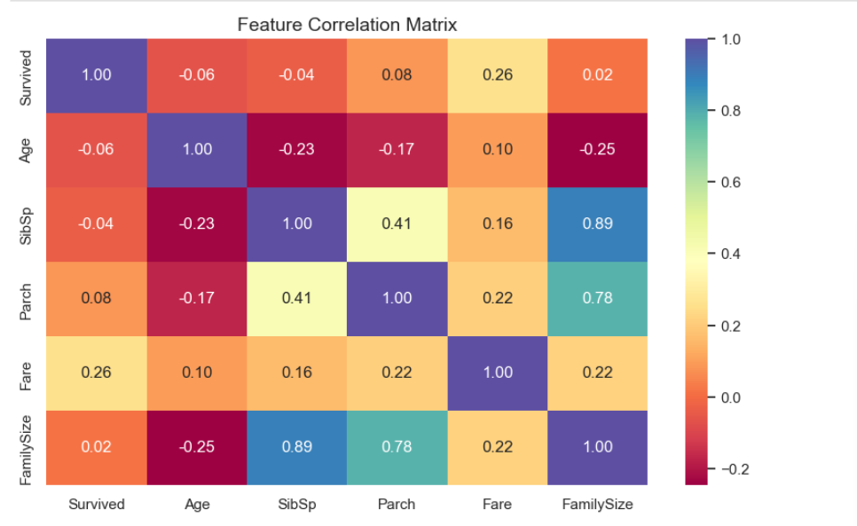

Titanic Survival Analysis

     

Overview

This project performs exploratory data analysis on the Titanic dataset to identify key factors influencing passenger survival. The analysis includes data preprocessing, feature engineering, and visualization to derive meaningful insights.

Project Structure
titanic-analysis/
│
├── titanic.csv
├── titanic-eda-analysis.ipynb
└── README.md
Methodology

A structured approach was followed including data cleaning, handling missing values, feature engineering, and visualization to analyze patterns affecting survival outcomes.

Sample Visualizations
Survival Distribution

  
 
Majority of passengers did not survive.

Survival by Gender

  
 
Females had a significantly higher survival rate.

Survival by Passenger Class

  
 
First-class passengers had higher survival probability.

Fare vs Survival

  
 
Higher fare passengers were more likely to survive.

Correlation Heatmap

  
 
Fare and class show noticeable correlation with survival.

Key Insights
Gender strongly influenced survival outcomes
First-class passengers had higher survival rates
Higher fare increased survival probability
Majority of passengers were young adults
Family size impacted survival patterns
Learning Outcomes
Data preprocessing and handling missing values
Feature engineering techniques
Data visualization using Matplotlib and Seaborn
Extracting and communicating insights from data
Conclusion

This project demonstrates how exploratory data analysis can uncover meaningful patterns in real-world datasets and provides a foundation for further machine learning applications.

Author

Jaffer Afzal Khan
